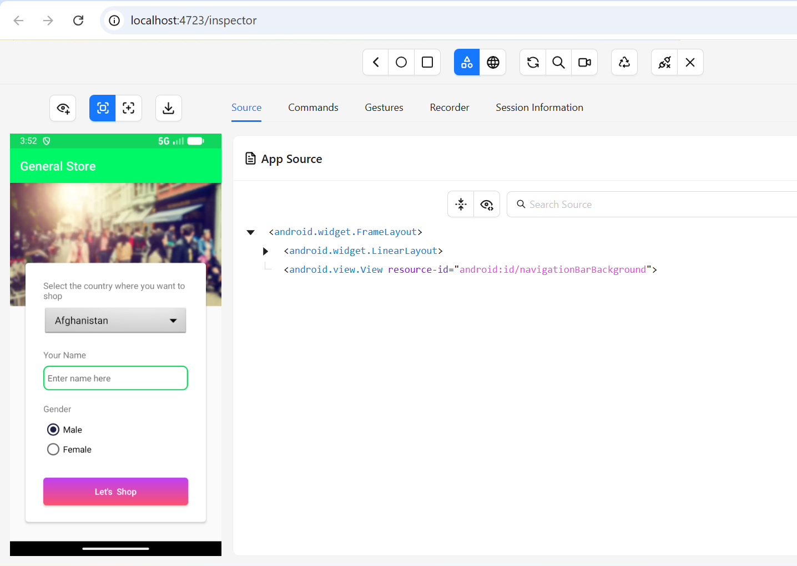

# 🚀 Appium TS Mobile Framework

A modern, robust, and scalable mobile automation framework built with **TypeScript**, **WebdriverIO (v9)**,
and **Appium**. This framework is designed for high reliability, ease of use, and local or cloud
(BrowserStack) test execution.

---

## 🏗️ Framework Architecture (In-Depth)

This framework follows the **Page Object Model (POM)** design pattern to ensure clean separation of test logic
from UI interactions.

### 📁 Directory Structure Breakdown

| Directory         | Purpose                        | Why & What's In It?                                                                                                                                                                                                  |
| :---------------- | :----------------------------- | :------------------------------------------------------------------------------------------------------------------------------------------------------------------------------------------------------------------- |
| `Base/`           | **Core Framework & Utilities** | Contains the shared logic that powers the framework. Includes the `BasePage` (common locators/actions), `sessionHelper` (logic for login/app state), `stepHelper` (reporting/logging steps), and custom `reporters`. |
| `configs/`        | **Execution Configuration**    | Houses WDIO configuration files. `wdio.shared.conf.ts` contains common logic, while `wdio.android.conf.ts` and `wdio.ios.conf.ts` handle platform-specific capabilities and local emulator auto-launching.           |
| `pages/`          | **Page Objects (UI Layer)**    | Defines app screens as classes. Each file (e.g., `LoginPage.ts`) contains selectors and interaction methods, keeping test scripts readable and maintainable.                                                         |
| `tests/`          | **Test Scripts & Data**        | Contains Mocha spec files (`*.spec.ts`). Sub-directory `testdata/` includes JSON files for data-driven testing (credentials, static text, etc.).                                                                     |
| `scripts/`        | **Automation Utilities**       | Helper scripts for environment setup, such as `setup-husky.mjs` for pre-commit hook initialization.                                                                                                                  |
| `allure-results/` | **Reporting Output**           | The raw JSON results generated during test execution, used by Allure to generate human-readable reports.                                                                                                             |
| `.husky/`         | **Git Hooks**                  | Automated checks (Linting & Formatting) that run before every commit to ensure code quality.                                                                                                                         |

---

## 🛠️ Prerequisites & Setup

Ensure your local environment is ready by following the
[**Local Prerequisites Guide**](./assets/LOCAL_PREREQUISITES.md).

### Quick Start

1. **Clone the Repo**: `git clone <repository-url>`
2. **Install Dependencies**:

   ```bash
   npm install
   ```

3. **Configure Environment**: Create or update your `.env` file with your BrowserStack credentials or local
   device names.

---

## ⚙️ Configuration & Environment

The framework uses environment variables (`.env`) to switch behavior dynamically:

- `LOCAL_APPIUM`: Set to `true` for local emulator/simulator, `false` for BrowserStack.
- `APP_ENV`: Selects the target environment (allowed: `DEV`, `ST`, `UAT`) and its credentials.
- `PLATFORM`: `android` or `ios`.
- `BROWSERSTACK_USERNAME` & `BROWSERSTACK_ACCESS_KEY`: Required for cloud execution.

---

## 📍 Reliable Window Positioning (AHK)

To ensure consistent test execution and a seamless developer experience, this framework solves the common
problem of inconsistent emulator window coordinates using **AutoHotkey (AHK)**.

- **Zero-Setup Optimization**: On the very first run of `npm run local:android`, the framework will detect if
  `scripts/autohotkey/AutoHotkey.exe` is missing. If so, it will **silently download** a portable, standalone
  version from the official site.
- **Why AHK?**: Unlike standard `wdio` commands, AHK allows us to "snap" the emulator window to precise screen
  coordinates (`1300, 0` by default) after the window appears, ensuring predictable layouts for manual
  inspection or automation.
- **Auto-Trigger**: The framework handles the AHK lifecycle automatically—triggering the
  `scripts/fix_emulator_position.ahk` script immediately after the emulator is spawned.

---

## 跑 Running Tests

| Command                   | Environment         | Description                                                           |
| :------------------------ | :------------------ | :-------------------------------------------------------------------- |
| `npm run local:android`   | **Local Android**   | Launches emulator, boots local Appium server, and runs Android tests. |
| `npm run local:ios`       | **Local iOS (Mac)** | Local iOS execution via Simulator.                                    |
| `npm run android:bs`      | **BrowserStack**    | Runs Android tests on BrowserStack's real devices.                    |
| `npm run ios:bs`          | **BrowserStack**    | Runs iOS tests on BrowserStack's real devices.                        |
| `npm run android:inspect` | **Inspector Mode**  | Launches app and pauses to allow inspection via Appium Inspector.     |
| `npm run clean:allure`    | **Maintenance**     | Removes old Allure results and reports.                               |
| `npm run allure:generate` | **Reporting**       | Generates and opens the Allure HTML report.                           |

---

## 📸 Appium Inspector Execution Screenshot



---

## 🎥 Framework Execution Video


---

## 💎 Code Quality & Maintenance

This framework enforces high code standards through automated tooling:

- **ESLint**: Custom rules ensure code consistency. Note that `.only` and `.skip` tests are flagged as
  **Warnings** to prevent accidental check-ins.
- **Prettier**: Handles all code formatting automatically.
- **Husky & lint-staged**: Automatically runs Linting and Formatting on your changed files before every
  `git commit`.
- **Typecheck**: Run `npm run typecheck` to verify TypeScript compliance project-wide.

> [!TIP] **Simplified Emulator Launch**: The Android config features a lean launcher (`startEmulatorIfNeeded`)
> that automatically finds your SDK, identifies the correct AVD, and waits for a full boot before starting
> tests.

---

## 📊 Reporting & Logs

- **Allure Reports**: Rich HTML reports with step-by-step breakdowns and screenshots.
- **Spec Summary**: A human-readable text summary of each run is saved to `logs/spec-summary.txt`.
- **Device Logs**: Captured in `logs/` for deep debugging of failures.

---

## 📝 Continuous Integration

The framework is ready for CI/CD pipelines, with an example configuration provided in `azure-pipelines.yml`,
supporting multi-device parallel execution on BrowserStack.
